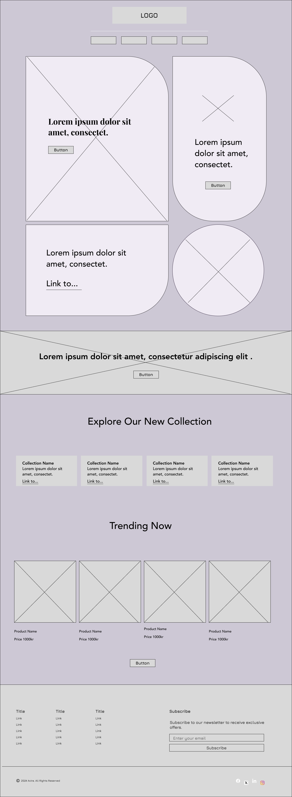

# Avira - Web Design & Development

<div style="display: flex; flex-direction: row; flex-wrap: wrap; gap: 20; justify-content: space-around; ">
   
   
   
 </div>

## Project Overview

### Requirements

- **Graphical Profile:** Utilized the graphical profile from the first assignment.
- **Wireframes & Mockups:** Created wireframes and mockups for both desktop (1440px) and mobile (640px) views.
- **Website Content:**
  - **Logo:** The website includes the logo created in the first assignment.
  - **Presentation:** A section dedicated to a personal or project presentation.
  - **Contact Section:** A contact form or contact information section.
  - **Product/Service Examples:** At least two examples of products or services offered.
  - **Design Only:** The website focuses on illustrating a functional design using HTML and CSS. No JavaScript or TypeScript functionality is required.

### Technology Stack

- **React:**
- **Tailwind CSS:**

## Project Structure

- **Wireframes:** Wireframes were created to outline the structure of the website for both desktop and mobile views. They provide a skeletal framework for the layout.
- **Mockups:** High-fidelity mockups were created based on the wireframes, applying the graphical profile to visualize the final design.
- **Website:** The website was then implemented using React and Tailwind CSS, following the design guidelines established in the mockups.

## Installation

1. **Clone the repository**

   ```bash
   git clone (https://github.com/CatAvadani/Avira-design.git)
   cd avira-design
   ```

2. **Install dependencies**

   ```bash
   npm install
   ```

3. **Start development server**
   ```bash
   npm run dev
   ```
