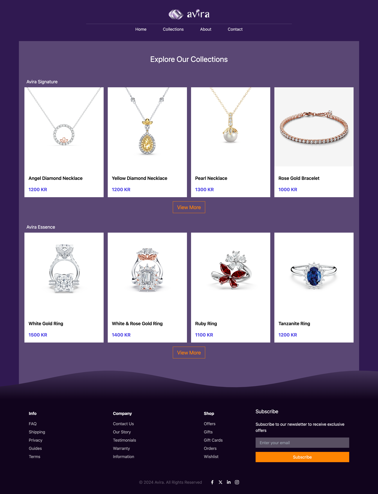
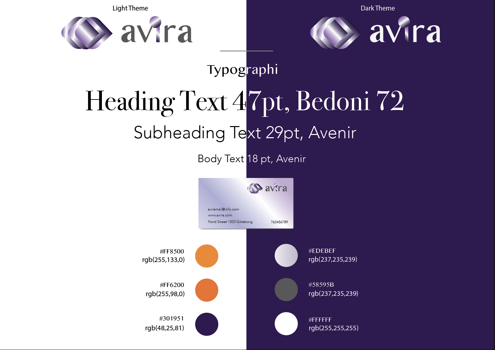

# Avira - Web Design & Development

<div style="display: flex; flex-direction: row; flex-wrap: wrap; gap: 20; justify-content: space-around;">
   
   
   

</div>

[Demo Link](https://avira-design.vercel.app/)


- **Graphical Profile:** Created using Adobe Ilustrator
- **Wireframes & Mockups:** Created wireframes and mockups for both desktop (1440px) and mobile (640px) views.
- **Website Content:**
  - **Logo:** The website includes the logo created using Adobe Ilustrator.
  - **Design Only:** The website focuses on illustrating a functional design 

### Technology Stack

- **React:**
- **Tailwind CSS:**
- **Figma**
- **Adobe Ilustrator**

## Project Structure

- **Wireframes:**
- **Mockups:**
- **Website:**

## Installation

1. **Clone the repository**

   ```bash
   git clone (https://github.com/CatAvadani/Avira-design.git)
   cd avira-design
   ```

2. **Install dependencies**

   ```bash
   npm install
   ```

3. **Start development server**
   ```bash
   npm run dev
   ```
